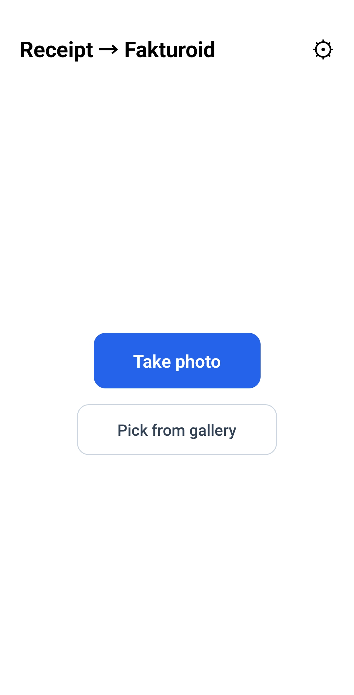
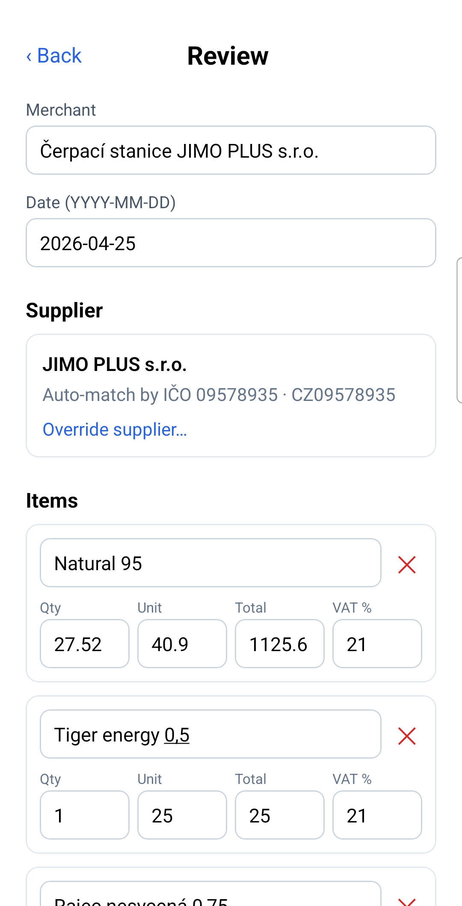
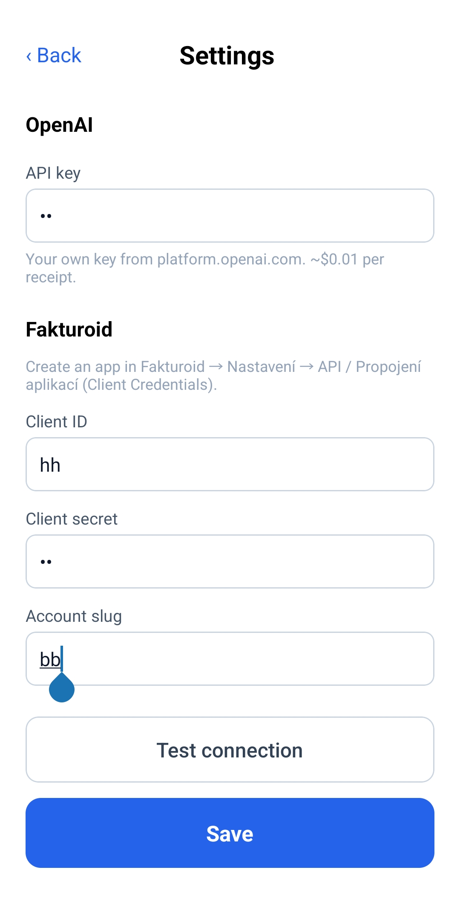

# Účtenkomat

Snap a photo of a Czech store receipt (**účtenka**) and turn it into an expense
(**náklad**) in [Fakturoid](https://www.fakturoid.cz) or [iDoklad](https://www.idoklad.cz) —
right from your phone or desktop. A vision LLM reads the receipt into structured data (items,
prices, per-line VAT, supplier IČO/DIČ), you review and edit, and the app files it in your
chosen accounting service.

No backend, no accounts to trust — you bring your own OpenAI key and your accounting
provider's API credentials, and they never leave your device.

```
┌──────────────┐   your OpenAI key     ┌──────────┐
│ Účtenkomat   │ ────────────────────▶ │  OpenAI  │  photo → structured JSON
│ Android +    │                       └──────────┘
│ desktop      │   your accounting     ┌──────────────────┐
│ capture →    │ ───credentials──────▶ │ Fakturoid /      │  match supplier by IČO,
│ review →     │                       │ iDoklad  API     │  create the expense (náklad)
│ confirm      │                       └──────────────────┘
└──────────────┘
```

## Features
- 📷 **Photo → expense** in a few taps; works on photos and gallery images.
- 🧾 **Czech receipts**: extracts line items, quantities, unit/total prices, and the
  **per-line VAT rate (DPH%)**.
- 🏢 **Supplier auto-match**: resolves the Fakturoid subject by **IČO** (creates it if
  missing), so "Čerpací stanice JIMO PLUS s.r.o." maps to the right legal entity. Manual
  override available.
- ✅ **Review before filing**: edit every field; built-in **VAT reconciliation** warns if
  the recap doesn't add up (catches OCR misreads before they hit your books).
- 🔐 **Bring your own keys (BYOK)**: keys live only in your device's secure storage.
- 💸 **~$0.01 per receipt** in OpenAI usage.

## Screenshots
<p align="center">
  
  &nbsp;
  
  &nbsp;
  
</p>
<p align="center"><em>Capture &nbsp;·&nbsp; Review (per-line VAT, supplier auto-matched by IČO) &nbsp;·&nbsp; Settings (BYOK)</em></p>

## Install
Grab the latest build from the [**Releases**](https://github.com/kubiq/uctenkomat/releases/latest) page.

**Android** (not on the Play Store — sideload the APK):
1. Download the `.apk` on your phone.
2. Open it; allow **installing unknown apps** when Android asks.
3. Open the app → **Settings** → enter your OpenAI key and Fakturoid Client ID / Secret / slug.

Auto-update with [Obtainium](https://github.com/ImranR98/Obtainium): *Add App* →
`https://github.com/kubiq/uctenkomat` — installs/updates from GitHub Releases,
no app store.

**Desktop** (keys are stored encrypted via the OS keyring):
- **Linux** — download the `.AppImage`, then `chmod +x Uctenkomat-*.AppImage` and run it.
- **Windows** — download and run the `.exe` installer.
- **macOS** — download the `.dmg` (Apple Silicon / arm64) and drag the app to Applications.

> **Unsigned app — how to open.** The desktop builds aren't code-signed (no paid
> Apple/Microsoft certificates), so the OS warns on first launch. It's safe to open:
> - **Windows** — at the "Windows protected your PC" SmartScreen prompt, click **More info → Run anyway**.
> - **macOS** — **right-click the app → Open**, then **Open** again in the dialog (don't double-click the first time). Or allow it under *System Settings → Privacy & Security*.

> iPhone isn't supported — Apple requires signing/$99-a-year, and a browser PWA would need a
> CORS proxy for Fakturoid. The desktop app (which uses Node under the hood) avoids that.

## How it works
The app talks directly to OpenAI and your accounting service — there is no server in between.

- `app/src/openai.ts` — sends the downscaled photo to OpenAI with **Structured Outputs**
  and a receipt JSON schema (`app/src/receipt.ts`).
- `app/src/accounting/` — pluggable provider interface with `fakturoid.ts` and `idoklad.ts`
  (OAuth token, search/create supplier by IČO, create expense with per-line VAT).
- `app/src/screens/` — Capture, Review (edit + VAT reconciliation), Settings, Success.

## Requirements
- An **OpenAI API key** — <https://platform.openai.com> (vision-capable, e.g. `gpt-4o`).
- An accounting account with API credentials — pick one in **Settings**:
  - **Fakturoid**: *Nastavení → API / Propojení aplikací → Nová aplikace* → **Client ID** +
    **Client Secret**; the **account slug** is the part in `https://app.fakturoid.cz/<slug>/…`.
  - **iDoklad**: *Nastavení → API* → **Client ID** + **Client Secret** (Client Credentials).
- For development: [Node.js](https://nodejs.org) + [Expo](https://expo.dev) and the **Expo
  Go** app (SDK 54) on an Android phone.

## Getting started (development)
```bash
git clone https://github.com/kubiq/uctenkomat.git
cd uctenkomat/app
npm install
npx expo start          # open in Expo Go on your phone
```
On first launch, open **Settings ⚙︎** and enter your OpenAI key and Fakturoid Client ID /
Secret / slug, then **Test connection** → **Save**. Take a photo, review the items and VAT,
pick/confirm the supplier, and **Create expense**.

See [`app/README.md`](app/README.md) for the Expo SDK note and troubleshooting (including
the "needs a newer Expo Go" message and LAN setup).

## Build an installable Android app
Standalone APK via [EAS Build](https://docs.expo.dev/build/introduction/) — no Google Play
account needed for personal use:
```bash
cd app
npm install -g eas-cli
eas login                                   # free Expo account
eas build -p android --profile preview      # → installable APK link
```
Open the resulting link on your phone to install. (`production` profile builds an AAB for
the Play Store.)

### Over-the-air updates
JS/UI changes ship without a rebuild once an EAS-Update-enabled build is installed:
```bash
eas update --branch preview -m "what changed"
```
Native changes (SDK bump, new native module, permissions, app version) still require a new
build.

## Privacy & data
- Your OpenAI and accounting keys are stored **only on your device** (secure-store on mobile,
  an OS-keyring-encrypted file on desktop, localStorage on web); they are sent only directly to
  OpenAI and your accounting provider.
- Receipt **images are sent to OpenAI** for parsing (subject to OpenAI's API data policy).
- Creating an expense writes a **real document** to your accounting account.
- Extraction can make mistakes — **review every expense before filing**, especially VAT.

## Tech stack
React Native · Expo (SDK 54) · TypeScript · Electron (desktop) · OpenAI (vision + Structured
Outputs) · Fakturoid / iDoklad API · EAS Build & Update + GitHub Actions.

## Status & roadmap
A personal/BYOK tool. A previous Node/Express backend was removed in favor of app-direct
(still in git history). The accounting backend is pluggable (`app/src/accounting/`) — Fakturoid
and iDoklad today. If this ever grows into a public, store-distributed app, a managed backend —
where users authorize via OAuth redirect and tokens are held server-side — would be a better fit
than each user pasting a client secret.

## Disclaimer
Not affiliated with Fakturoid, iDoklad, or OpenAI. Provided as-is; you are responsible for the
accuracy of the accounting data it produces. Always verify amounts and VAT before filing.

## License
[MIT](LICENSE)
